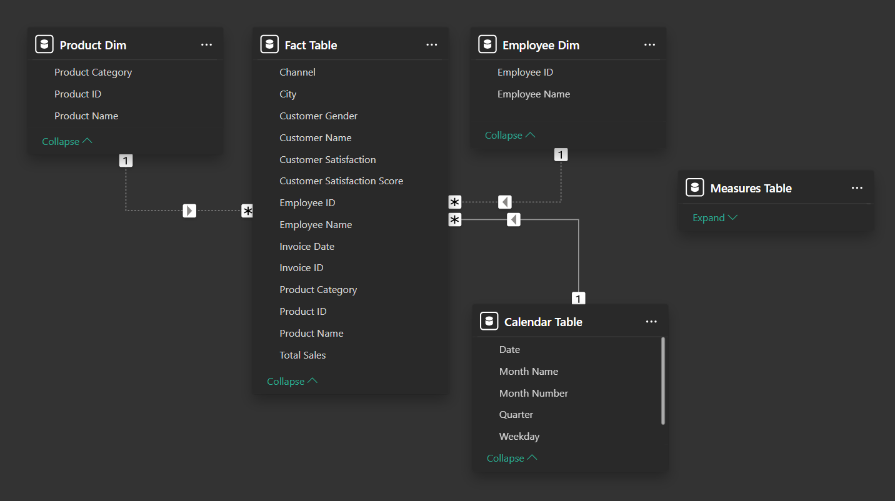

# Sales Performance Report Using Power-BI
This report provides an interactive analysis of sales data using **Power BI**  
The data was sourced from **Kaggle**: [Sales in Saudi Arabia](https://www.kaggle.com/datasets/shilton123456/sales-in-saudi-arabia)  


# Steps Performed:
**Data Cleaning & Transformation**
- Cleaned and transformed data using **Power Query** to ensure accuracy and consistency

**Data Modeling**
- Created a **Data Model** to define relationships between tables
  
  

**Measures & DAX Calculations**
- Built **DAX measures** for key metrics and KPIs, such as:
       ```
  Total Sales = SUM('Fact Table'[Total Sales])  
  AVG Sales Per Invoice = DIVIDE([Total Sales], [Invoices Count])  
  Sales Growth % = DIVIDE([YTD] - [YTD Last Year], [YTD Last Year])  
  Customer Satisfaction % = DIVIDE ( AVERAGE ( 'Fact Table'[Customer Satisfaction Score] ), 3 ) * 100  
  Sales Target = [Total Sales] * 1.1
       ```
 

**Report Visualization**  
  - Created interactive visuals with forecasting to highlight trends and support data-driven insights.
